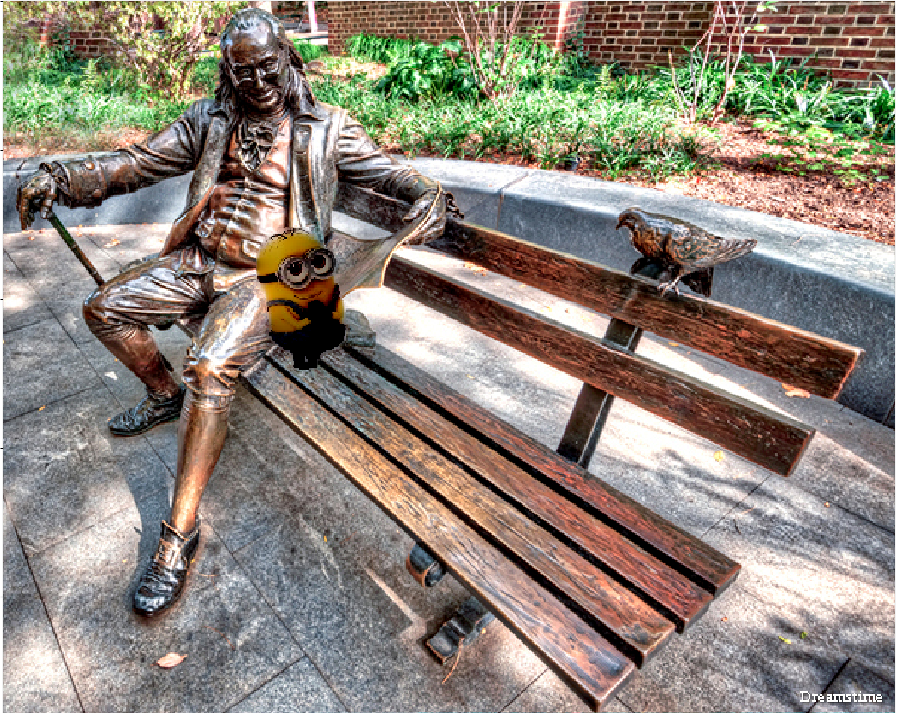
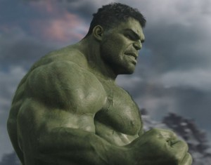
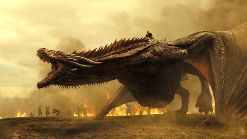
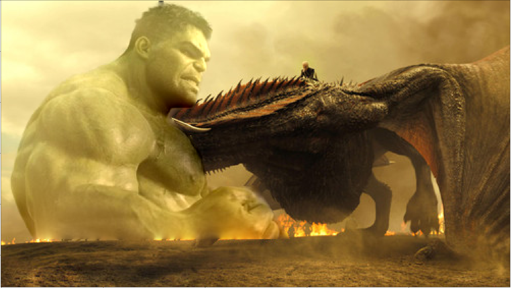
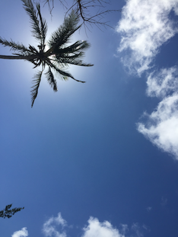
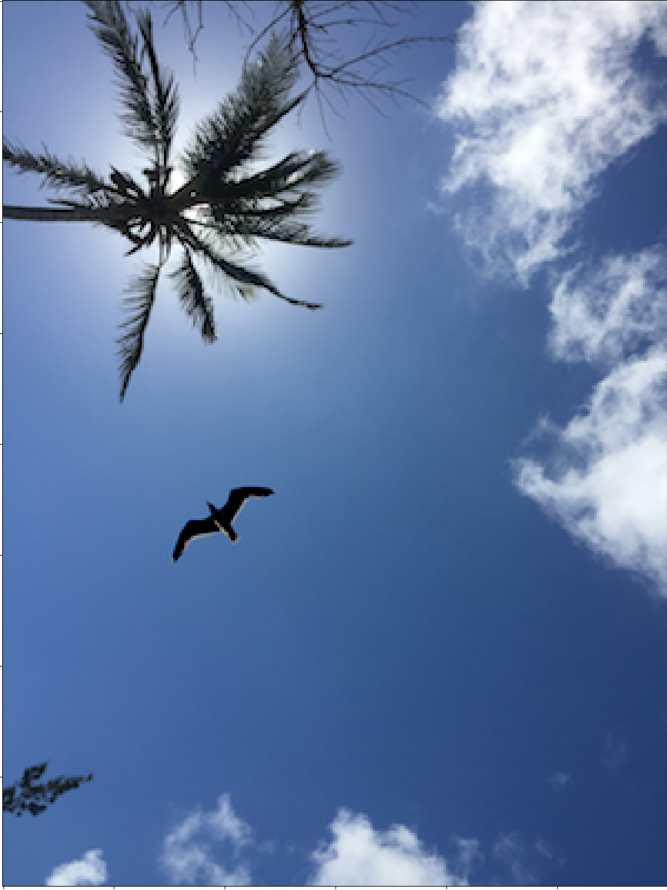

## Image Gradient Blending

The goal of the project is to seamlessly blend an object from a source image into a target image. I have implemented images in the gradient domain using Poisson Image Editing. It is a gradient-domain processing technique with numerous applications such as blending, non-photorealistic rendering, contrast enhancement, texture flattening and tone-mapping.for automatically and seamlessly blending two images together.

1. The mask_creator.py script facilitates creating the mask in the source image. When the interactive tool to blend images pops up, press i to introduce more coordinates and create the mask.

2. The intensity of the replacement pixels in the target pixel can be found using the linear system Ax = b. But, not all the pixels need to be computed. Only the pixels masked as 1 in the logical mask will be used to blend. In order to reduce the number of calculations, I have indexed the replacement pixels such that
each element in x represents one replacement pixel. The script getIndexes does the same.

3. Then the script getCoefficientMatrix generates the coefficient matrix A. 

4. The script getSolutionVector generates the solution vector b.

5. The function seamlessCloningPoisson calls these functions and generated the solutions to x.

6. The wrapper function demo_script.py is used to run the code.

In demo_script.py give the name of the image files in the sourceImage and targetImage variables and set the offset values. 
For the images I have tested on, the offset for franklin and minion was offsetX, offsetY = 150,150
For JohnCena and Mona lisa it was 175,75 and for the bird sky images it was 0,0 and same for Hulk and dracarys (Looks like Khaleesi did not anticipate this move by cercie, but nevertheless dracarys went straignt inside hulk's heart, dont know if the smash he is going for will be effective now)

Then run python3 demo_script.py.

The mask creator will pop up, press i to insert more points in the mask creator and use the points to create the mask. 

Press q to quit the mask creator and the mask created will pop up, press q again and then the final blended image will be displayed on the scene. Some of the results on the images I tested on:

  
   
   

  
  
   

  
   
   

